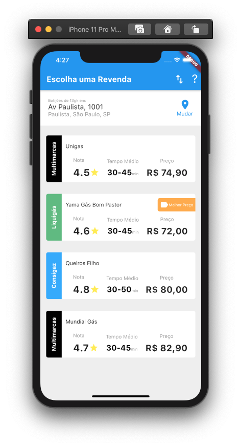
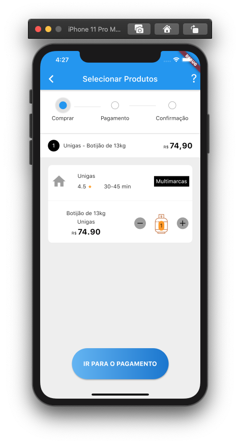

<h1 align=center>

</h1>

<h3 align="center">

Revenda Gás é um projeto **APP** desenvolvido no bootcamp **Acadêmia do Flutter** guiado por **[Rodrigo Rahman]** utilizando as tecnologias ***Dart, e Flutter***.

</h3>



## **:rocket: OBJETIVO**

O projeto tem como finalidade **melhorar meus conhecimentos** nas tecnologias **FLUTTER e DART**

## **:computer: TECNOLOGIAS**


#### **Mobile** 

  - **[DART]**
  - **[FLUTTER]**
  - **[JSON]**
## **:wine_glass: COMO UTILIZAR**

### Configurações Iniciais

Primeiro, você precisa ter o <kbd>[DART](https://dart.dev/get-dart)</kbd>
e o <kbd>[FLUTTER](https://flutter.dev/?gclid=CjwKCAiAjp6BBhAIEiwAkO9WuvPkhsREYR4PEJiIVVZmJ8o2tTwcHk1a7TwKkmHVoRKiwO9RyYdSexoCQmQQAvD_BwE&gclsrc=aw.ds)</kbd> instalados na sua máquina. 

Após ter o **Dart** e o **Flutter** instalados, instale as dependências do **PROJETO** utilizando o comando:

```sh
$ flutter pub get
```

E pronto... Você já pode executar o app no seu emulados ou dispositivo físico.
## **:page_with_curl: LICENÇA**

<h2 align="center">Feito com ❤️ por <a href="linkedin.com/in/lucas-bercê-de-jesus-bb228416a">Lucas Bercê de Jesus</a></h2>

<!-- Website Links -->

[rocketseat_site]: https://rocketseat.com.br/

<!-- Badges -->

[github_issues_badge]: https://img.shields.io/github/issues/x0n4d0/ecoleta?color=green

[repository_license_badge]: https://img.shields.io/github/license/x0n4d0/ecoleta

<!-- Techs -->

[vscode]: https://code.visualstudio.com/

[stackedit]: https://stackedit.io

[markdown_emoji]: https://gist.github.com/rxaviers/7360908

[commitlint]: https://github.com/conventional-changelog/commitlint

[feather_icons]: https://feathericons.com/

[font_roboto]: https://fonts.google.com/specimen/Roboto

[font_ubuntu]: https://fonts.google.com/specimen/Ubuntu

[font_awesome]: https://fontawesome.com/